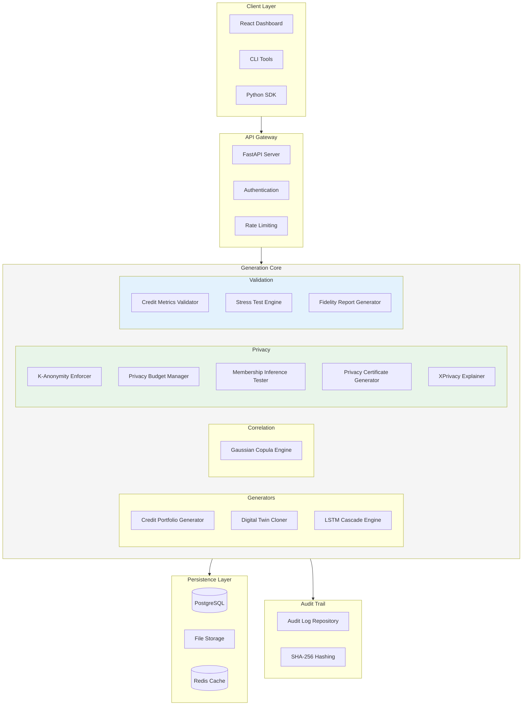
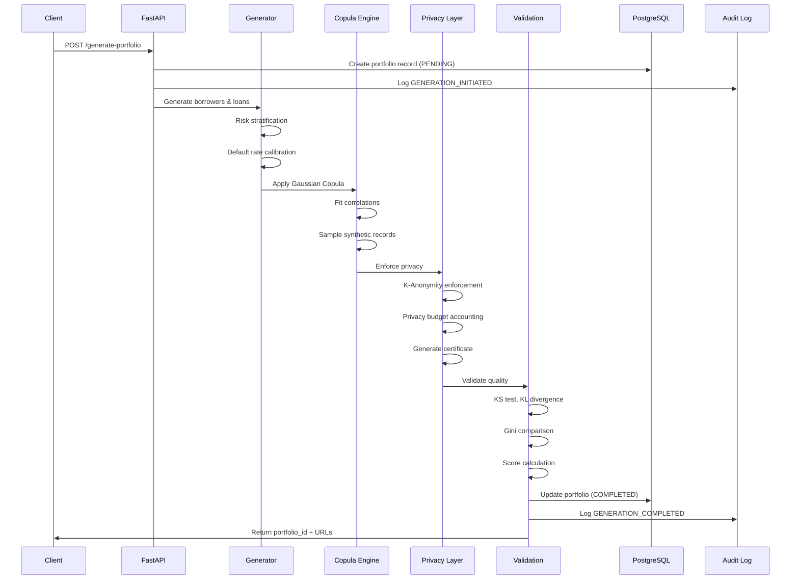
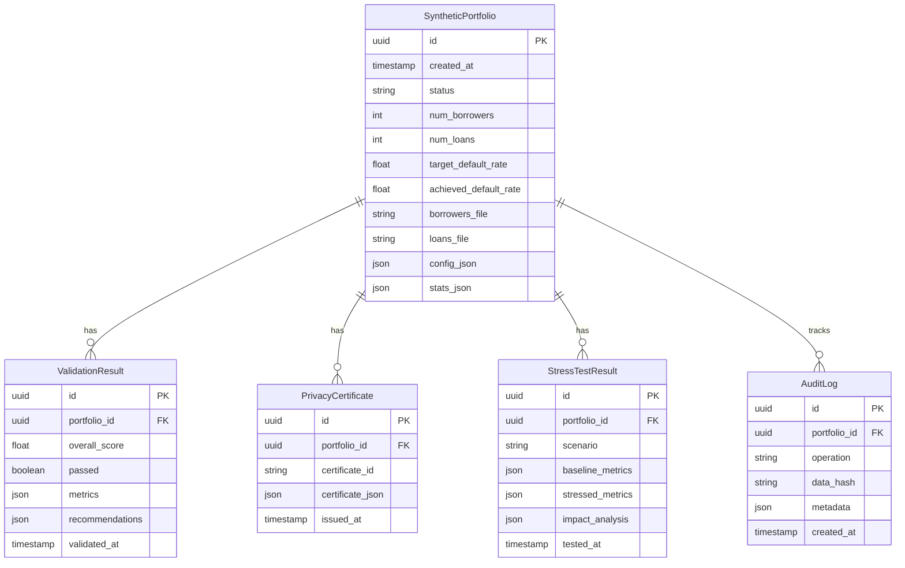

# System Architecture

## Enterprise Deep-Tech Architecture for Synthetic Credit Data

Pratibimba's architecture is designed for **enterprise-scale deployments** with modularity, auditability, and regulatory compliance at its core.

---

## High-Level Architecture



---

## Component Deep Dive

### Generation Layer

| Component | Purpose | Technology |
|-----------|---------|------------|
| **Credit Portfolio Generator** | Generate synthetic borrowers and loans with risk-stratified profiles | Python, NumPy, Faker |
| **Digital Twin Cloner** | Train and sample from Gaussian Copula models | `copulas` library, NumPy fallback |
| **LSTM Cascade Engine** | Model temporal payment dynamics | PyTorch, statistical fallback |
| **Gaussian Copula Engine** | Preserve correlation structure | `copulas`, SciPy |

### Privacy Layer

| Component | Purpose | Technology |
|-----------|---------|------------|
| **K-Anonymity Enforcer** | Guarantee k≥5 through intelligent generalization | Pandas, NumPy |
| **Privacy Budget Manager** | Track cumulative ε with composition theorems | Custom implementation |
| **Membership Inference Tester** | Simulate adversarial attacks | Scikit-learn RandomForest |
| **Privacy Certificate Generator** | Create audit-ready privacy proofs | Custom + ReportLab |
| **XPrivacy Explainer** | Natural language privacy explanations | Custom NLP templates |

### Validation Layer

| Component | Purpose | Technology |
|-----------|---------|------------|
| **Credit Metrics Validator** | Statistical comparison of synthetic vs original | SciPy (KS, KL), NumPy |
| **Stress Test Engine** | Economic scenario simulation | Custom financial models |
| **Fidelity Report Generator** | PDF and JSON reports | ReportLab, JSON |

---

## Data Flow Pipeline



---

## Database Schema



---

## Technology Stack

### Backend

| Layer | Technology | Purpose |
|-------|------------|---------|
| **API Framework** | FastAPI 0.100+ | High-performance async API |
| **Database** | PostgreSQL 15+ | ACID-compliant persistence |
| **ORM** | SQLAlchemy 2.0 (async) | Database abstraction |
| **Cache** | Redis (optional) | Query caching, rate limiting |
| **Task Queue** | BackgroundTasks | Async job processing |

### ML/Statistical

| Library | Purpose |
|---------|---------|
| **PyTorch** | LSTM cascade models |
| **copulas** | Gaussian copula fitting and sampling |
| **scikit-learn** | Membership inference attack simulation |
| **SciPy** | KS tests, statistical distributions |
| **NumPy** | Core numerical operations |
| **Pandas** | Data manipulation |
| **Faker** | Realistic attribute generation |

### Reporting

| Library | Purpose |
|---------|---------|
| **ReportLab** | PDF report generation |
| **JSON** | Structured data export |

### Frontend (Optional)

| Technology | Purpose |
|------------|---------|
| **React 18** | Dashboard UI |
| **Recharts** | Data visualization |
| **Axios** | API communication |

---

## Deployment Architecture

### Docker Deployment

```yaml
# docker-compose.yml
version: '3.8'

services:
  api:
    build: ./backend
    ports:
      - "8000:8000"
    environment:
      - DATABASE_URL=postgresql://user:pass@db:5432/pratibimba
      - REDIS_URL=redis://cache:6379
    depends_on:
      - db
      - cache
    volumes:
      - ./data:/app/data
      - ./reports:/app/reports
    
  db:
    image: postgres:15-alpine
    volumes:
      - postgres_data:/var/lib/postgresql/data
    environment:
      - POSTGRES_USER=user
      - POSTGRES_PASSWORD=pass
      - POSTGRES_DB=pratibimba
    
  cache:
    image: redis:7-alpine
    volumes:
      - redis_data:/data
    
  frontend:
    build: ./frontend
    ports:
      - "3000:80"
    depends_on:
      - api

volumes:
  postgres_data:
  redis_data:
```

### Kubernetes Deployment

```yaml
# k8s/deployment.yaml
apiVersion: apps/v1
kind: Deployment
metadata:
  name: pratibimba-api
  labels:
    app: pratibimba
spec:
  replicas: 3
  selector:
    matchLabels:
      app: pratibimba
  template:
    metadata:
      labels:
        app: pratibimba
    spec:
      containers:
      - name: api
        image: pratibimba/api:latest
        ports:
        - containerPort: 8000
        resources:
          requests:
            memory: "512Mi"
            cpu: "500m"
          limits:
            memory: "2Gi"
            cpu: "2000m"
        env:
        - name: DATABASE_URL
          valueFrom:
            secretKeyRef:
              name: pratibimba-secrets
              key: database-url
        livenessProbe:
          httpGet:
            path: /health
            port: 8000
          initialDelaySeconds: 30
          periodSeconds: 10
---
apiVersion: v1
kind: Service
metadata:
  name: pratibimba-api
spec:
  selector:
    app: pratibimba
  ports:
  - port: 80
    targetPort: 8000
  type: LoadBalancer
```

---

## Security Architecture

### Data Security

| Control | Implementation |
|---------|----------------|
| **Encryption at Rest** | PostgreSQL TDE, encrypted volumes |
| **Encryption in Transit** | TLS 1.3 for all API traffic |
| **Access Control** | JWT authentication, role-based access |
| **Audit Logging** | Immutable SHA-256 hashed audit trail |
| **Data Isolation** | Per-tenant data segregation |

### Privacy Controls

| Control | Implementation |
|---------|----------------|
| **Differential Privacy** | ε-bounded noise injection |
| **K-Anonymity** | Minimum k=5 enforced for all outputs |
| **Privacy Budgeting** | Per-dataset cumulative ε tracking |
| **Membership Inference Protection** | Attack success rate <55% verified |

### Compliance

| Regulation | Support |
|------------|---------|
| **GDPR** | Anonymous data (ε≤1.0) |
| **CCPA** | Exempt synthetic data |
| **HIPAA** | Safe Harbor compliant (k≥5, ε≤1.0) |
| **OCC SR 11-7** | Model risk documentation |
| **FDIC MRMG** | Model governance templates |
| **UK PRA SS1/23** | Stress testing documentation |

---

## Performance Characteristics

### Throughput Benchmarks

| Operation | Records | Time | Hardware |
|-----------|---------|------|----------|
| Portfolio Generation | 10,000 borrowers | ~2.5s | 4 vCPU, 8GB RAM |
| Portfolio Generation | 100,000 borrowers | ~25s | 4 vCPU, 8GB RAM |
| Digital Twin Cloning | 50,000 records | ~45s | 4 vCPU, 8GB RAM |
| LSTM Sequence Generation | 10,000 sequences x 24 months | ~30s | 4 vCPU, 8GB RAM |
| Privacy Audit | 50,000 records | ~15s | 4 vCPU, 8GB RAM |
| Stress Testing | 50,000 loans | ~5s | 4 vCPU, 8GB RAM |

### Scalability

- **Horizontal**: API layer scales horizontally behind load balancer
- **Vertical**: Generation components benefit from more CPU/RAM
- **GPU Optional**: LSTM training accelerated with CUDA (not required)

---

## Extensibility

### Adding Custom Generators

```python
from fintech.generators.base import BaseGenerator

class CustomCreditGenerator(BaseGenerator):
    """Your custom generator implementation."""
    
    def generate_borrowers(self, config):
        # Custom borrower generation logic
        pass
    
    def generate_loans(self, borrowers, config):
        # Custom loan generation logic
        pass
```

### Adding Custom Validators

```python
from fintech.validation.base import BaseValidator

class CustomValidator(BaseValidator):
    """Your custom validation logic."""
    
    def validate(self, original_df, synthetic_df):
        # Custom validation metrics
        return {
            "custom_score": 95.5,
            "passed": True
        }
```

### Adding Custom Stress Scenarios

```python
from fintech.validation.stress_test import StressScenario

custom_scenarios = {
    "pandemic_shock": StressScenario(
        name="Pandemic Shock",
        default_rate_multiplier=2.5,
        recovery_rate_reduction=0.3,
        interest_rate_change=0.0,
        economic_impact="severe"
    )
}
```

---

## Next Steps

- [Credit Portfolio Generator →](./credit-portfolio-generator.md)
- [Digital Twin Cloning →](./digital-twin-cloning.md)
- [Privacy Framework →](./privacy-guarantees.md)
- [API Reference →](./api-reference.md)
