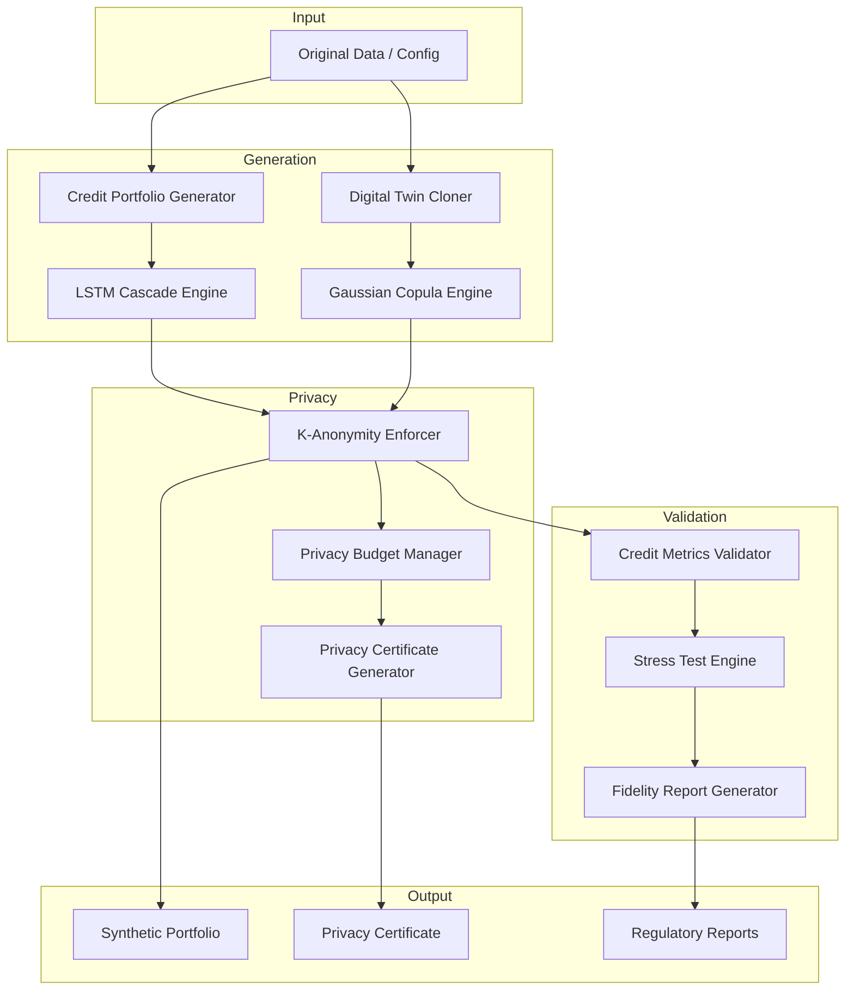

# Pratibimba Fintech Module

## Enterprise-Grade Synthetic Credit Data Platform

> **Generate production-quality synthetic credit portfolios with bank-grade privacy, regulatory compliance, and statistical fidelity that rivals the gold standard.**

---

## What is Pratibimba Fintech?

Pratibimba (Sanskrit: "reflection") is an **enterprise synthetic data platform** purpose-built for the financial services industry. It enables banks, fintech companies, and lending institutions to generate **statistically authentic credit portfolios** while maintaining **provable privacy guarantees** and **regulatory compliance**.

Unlike generic synthetic data tools that treat financial data as just another tabular format, Pratibimba understands the **deep structure of credit risk**:

- **Risk stratification** across credit grades (A through E)
- **Correlation dependencies** between credit scores, income, and default probability
- **Temporal dynamics** of payment behavior and delinquency cascades
- **Tail risk preservation** for extreme scenarios

---

## Why Pratibimba?

### The Challenge

Banks face an impossible trilemma:

1. **Data Privacy**: Real customer data cannot be shared for model development, testing, or third-party collaboration
2. **Data Quality**: Synthetic data must preserve statistical properties that make models performant
3. **Regulatory Compliance**: OCC, FDIC, and PRA require auditability of synthetic data usage

### The Solution

Pratibimba solves all three simultaneously through a **deep-tech approach** combining:

| Technology | Purpose | Competitor Gap |
|------------|---------|----------------|
| **Gaussian Copulas** | Preserve correlation structure and marginal distributions | Most tools ignore tail dependencies |
| **LSTM Cascade Models** | Model delinquency progression over time | No competitor offers this |
| **Privacy Budget Tracking** | Real-time differential privacy accounting with composition theorems | Industry first |
| **XPrivacy** | Natural language explanations of privacy for legal teams | Unique differentiator |
| **Regulatory Templates** | OCC SR 11-7, FDIC MRMG, UK PRA SS1/23 reports | Built-in, not add-on |

---

## Key Capabilities

### 🏦 Credit Portfolio Generation
Generate synthetic borrowers and loans with **realistic risk distributions** that match your target portfolio characteristics. Default rates calibrated within **±1% tolerance**.

[Learn more →](./credit-portfolio-generator.md)

### 🧬 Digital Twin Cloning
Train a **statistical twin** of your production data using Gaussian Copulas. The cloned data preserves correlation structure while guaranteeing **k-anonymity ≥ 5** for regulatory compliance.

[Learn more →](./digital-twin-cloning.md)

### 📈 LSTM Delinquency Cascades
Model the **temporal dynamics of payment behavior** using autoregressive LSTM networks. Capture the reality that a missed payment today increases default probability tomorrow.

[Learn more →](./lstm-cascade-engine.md)

### 🔒 Privacy & Compliance
Comprehensive privacy framework with **differential privacy**, **k-anonymity enforcement**, **membership inference testing**, and **privacy certificates** for audit trail.

[Learn more →](./privacy-guarantees.md)

### 💡 Explainable Privacy (XPrivacy)
**Unique differentiator**: Translate technical privacy parameters (ε, δ, k) into natural language that **legal and compliance teams can understand**.

[Learn more →](./xprivacy-explainability.md)

### ✅ Statistical Validation
Rigorous validation using **Gini coefficients**, **KS tests**, **KL divergence**, and **correlation matrix analysis**. Automated pass/fail scoring with actionable recommendations.

[Learn more →](./validation-quality.md)

### 📊 Stress Testing
Pre-built economic stress scenarios including **2008-style severe recession**, **interest rate shocks**, and **housing market crashes**. Plausibility validation against historical data.

[Learn more →](./stress-testing.md)

### 📋 Regulatory Reporting
Generate audit-ready reports in PDF and JSON formats with **OCC**, **FDIC**, and **PRA** regulatory templates built-in.

[Learn more →](./regulatory-reports.md)

---

## Quick Start

### Generate Your First Portfolio

```bash
curl -X POST http://localhost:8000/api/fintech/generate-portfolio \
  -H "Content-Type: application/json" \
  -d '{
    "num_borrowers": 10000,
    "target_default_rate": 0.035,
    "default_rate_tolerance": 0.01,
    "include_payment_history": true,
    "history_months": 24,
    "use_copulas": true,
    "privacy_epsilon": 1.0,
    "k_anonymity": 5
  }'
```

### Response

```json
{
  "portfolio_id": "SYNTH_20260202_163045_a1b2",
  "status": "completed",
  "num_borrowers": 10000,
  "num_loans": 14523,
  "achieved_default_rate": 0.0347,
  "target_default_rate": 0.035,
  "generation_time_seconds": 2.34,
  "download_urls": {
    "borrowers": "/api/fintech/download/SYNTH_20260202_163045_a1b2/borrowers.csv",
    "loans": "/api/fintech/download/SYNTH_20260202_163045_a1b2/loans.csv"
  }
}
```

---

## Competitive Advantages

| Feature | Pratibimba | Tonic.ai | Gretel | Mostly AI | SDV |
|---------|------------|----------|--------|-----------|-----|
| **Credit-Specific Generation** | ✅ Native | ❌ Generic | ❌ Generic | ❌ Generic | ❌ Generic |
| **LSTM Delinquency Cascades** | ✅ | ❌ | ❌ | ❌ | ❌ |
| **Privacy Budget Tracking** | ✅ Real-time | ❌ | ⚠️ Basic | ❌ | ❌ |
| **Explainable Privacy (XPrivacy)** | ✅ | ❌ | ❌ | ❌ | ❌ |
| **Regulatory Report Templates** | ✅ OCC/FDIC/PRA | ❌ | ❌ | ⚠️ Basic | ❌ |
| **Stress Testing** | ✅ 5 scenarios | ❌ | ❌ | ❌ | ❌ |
| **K-Anonymity Enforcement** | ✅ Automatic | ⚠️ Manual | ⚠️ Manual | ⚠️ Manual | ❌ |
| **Open Source** | ✅ MIT | ❌ Proprietary | ❌ Proprietary | ❌ Proprietary | ✅ |
| **Self-Hosted** | ✅ | ⚠️ Enterprise only | ⚠️ Enterprise only | ⚠️ Enterprise only | ✅ |

[Full comparison →](./comparisons.md)

---

## Use Cases

### Model Development
Generate realistic training data for credit scoring, underwriting, and collections models without exposing customer PII.

### Regulatory Stress Testing
Validate portfolio resilience across economic scenarios required by CCAR, DFAST, and PRA stress testing mandates.

### Third-Party Sharing
Safely share data with vendors, consultants, and ML platforms while maintaining provable privacy guarantees.

### Development Environments
Populate dev/test environments with production-representative data without compliance risk.

[See all use cases →](./use-cases.md)

---

## Architecture Overview



[Full architecture →](./architecture.md)

---

## API Reference

Complete REST API with 20+ endpoints covering the full synthetic data lifecycle:

- Portfolio generation and cloning
- Payment sequence generation
- Validation and quality metrics
- Privacy auditing and certificates
- Stress testing
- Report generation

[API Reference →](./api-reference.md)

---

## Getting Started

1. **[Installation Guide](./architecture.md#deployment-architecture)** - Docker, Kubernetes, or bare metal
2. **[Quick Start Tutorial](#quick-start)** - Generate your first portfolio in 5 minutes
3. **[API Reference](./api-reference.md)** - Complete endpoint documentation
4. **[Use Cases](./use-cases.md)** - Real-world applications

---

## License

Pratibimba Fintech is open source under the **MIT License**. Use it, modify it, deploy it—no vendor lock-in, no per-seat licensing, no data egress fees.

---

<div align="center">

**Built for banks. Open for everyone.**

[GitHub](https://github.com/ramprag/DataRobo) · [API Docs](http://localhost:8000/docs) · [Report Issues](https://github.com/ramprag/DataRobo/issues)

</div>
