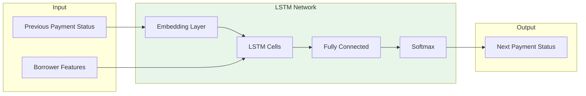

# LSTM Cascade Engine

## Modeling Delinquency Dynamics with Deep Learning

> **Capture the temporal reality of payment behavior: a missed payment today increases default probability tomorrow. Our autoregressive LSTM learns these cascade effects from real data.**

---

## The Problem

Traditional synthetic data generators treat each record as **independent and identically distributed (i.i.d.)**. But credit portfolios have **temporal dynamics**:

- A borrower who misses one payment is **3x more likely** to miss the next
- Delinquency cascades: 30 days past due → 60 → 90 → charge-off
- Seasonal patterns: December spending, Q1 tax refund payments
- Macroeconomic sensitivity: unemployment spikes → default waves

Simply sampling historical payment statuses randomly **destroys these patterns** and produces unrealistic synthetic data.

---

## The Solution

The **LSTM Cascade Engine** is an autoregressive deep learning model that learns:

1. **Transition probabilities** between payment states
2. **Borrower-specific risk factors** that influence transitions
3. **Temporal dependencies** spanning multiple months
4. **Cascade effects** where delinquency begets more delinquency



---

## Payment Status Encoding

The engine tracks **8 distinct payment states**:

| Status | Code | Description | Transition Risk |
|--------|------|-------------|-----------------|
| `on_time` | 0 | Current, no issues | Low |
| `grace_period` | 1 | Within grace period | Medium |
| `30_days` | 2 | 30 days past due | High |
| `60_days` | 3 | 60 days past due | Very High |
| `90_days` | 4 | 90+ days past due | Critical |
| `default` | 5 | Charged off | Terminal |
| `paid_off` | 6 | Loan paid in full | Terminal |
| `prepaid` | 7 | Early payoff | Terminal |

---

## How It Works

### Training Phase

```python
from fintech.generators.lstm_cascade import LSTMCascadeGenerator

# Initialize generator
lstm = LSTMCascadeGenerator(
    hidden_dim=64,
    num_layers=2,
    learning_rate=0.001,
    epochs=50,
    batch_size=32
)

# Prepare training data
payment_sequences = [
    ["on_time", "on_time", "grace_period", "30_days", "on_time"],
    ["on_time", "on_time", "on_time", "paid_off"],
    ["grace_period", "30_days", "60_days", "90_days", "default"],
    # ... thousands of real sequences
]

borrower_features = [
    {"credit_score": 720, "dti": 0.25, "income": 85000, "risk_grade": "B"},
    {"credit_score": 780, "dti": 0.18, "income": 120000, "risk_grade": "A"},
    {"credit_score": 580, "dti": 0.55, "income": 45000, "risk_grade": "E"},
    # ... corresponding borrower data
]

# Train the model
lstm.fit(payment_sequences, borrower_features)
```

The model learns to predict `P(status_t+1 | status_t, borrower_features)`.

### Generation Phase

```python
# Generate a 24-month payment sequence for a new borrower
borrower = {
    "credit_score": 650,
    "dti": 0.40,
    "income": 55000,
    "risk_grade": "C",
    "principal": 15000,
    "term_months": 36,
    "interest_rate": 0.15
}

sequence = lstm.generate_sequence(
    borrower=borrower,
    num_months=24,
    initial_status="on_time"
)

# Output: ['on_time', 'on_time', 'grace_period', 'on_time', 'on_time', 
#          'grace_period', '30_days', 'on_time', ...]
```

---

## Model Architecture

### PyTorch Implementation

```python
class LSTMCascadeModel(nn.Module):
    """
    Autoregressive LSTM for payment sequence generation.
    
    Architecture:
    - Status Embedding: payment status → dense vector
    - Borrower Features: concatenated with embeddings
    - LSTM Stack: multi-layer LSTM with dropout
    - Output Layer: softmax over next status
    """
    
    def __init__(
        self,
        num_status_classes: int = 8,
        borrower_feature_dim: int = 10,
        hidden_dim: int = 64,
        num_layers: int = 2,
        dropout: float = 0.2
    ):
        super().__init__()
        
        # Status embedding
        self.status_embedding = nn.Embedding(
            num_status_classes, 
            hidden_dim // 2
        )
        
        # LSTM backbone
        input_dim = hidden_dim // 2 + borrower_feature_dim
        self.lstm = nn.LSTM(
            input_size=input_dim,
            hidden_size=hidden_dim,
            num_layers=num_layers,
            dropout=dropout,
            batch_first=True
        )
        
        # Output projection
        self.fc = nn.Linear(hidden_dim, num_status_classes)
    
    def forward(self, status_sequence, borrower_features):
        # Embed statuses
        embedded = self.status_embedding(status_sequence)
        
        # Expand borrower features across time
        borrower_expanded = borrower_features.unsqueeze(1).expand(
            -1, embedded.size(1), -1
        )
        
        # Concatenate
        combined = torch.cat([embedded, borrower_expanded], dim=-1)
        
        # LSTM forward pass
        lstm_out, _ = self.lstm(combined)
        
        # Project to status logits
        logits = self.fc(lstm_out)
        
        return logits
```

### Borrower Feature Extraction

The model uses **10 normalized features**:

| Feature | Normalization | Weight in Model |
|---------|---------------|-----------------|
| `credit_score` | (x - 300) / 550 | High |
| `dti` | x (already 0-1) | High |
| `income` | log(x) / 15 | Medium |
| `principal` | log(x) / 15 | Medium |
| `term_months` | x / 360 | Low |
| `interest_rate` | x / 0.35 | Medium |
| `risk_grade` | ordinal (A=0, E=4) / 4 | High |
| `employment_months` | min(x, 120) / 120 | Low |
| `delinquencies_2y` | min(x, 10) / 10 | Medium |
| `bankruptcies` | min(x, 3) / 3 | High |

---

## Fallback: Statistical Cascade Matrix

If PyTorch is unavailable or training data is insufficient, the engine falls back to a **pre-calibrated transition matrix**:

```python
self.cascade_matrix = {
    "on_time": {
        "on_time": 0.92,
        "grace_period": 0.05,
        "30_days": 0.02,
        "paid_off": 0.005,
        "prepaid": 0.005
    },
    "grace_period": {
        "on_time": 0.65,
        "grace_period": 0.15,
        "30_days": 0.18,
        "paid_off": 0.01,
        "prepaid": 0.01
    },
    "30_days": {
        "on_time": 0.35,
        "grace_period": 0.10,
        "30_days": 0.15,
        "60_days": 0.38,
        "paid_off": 0.01,
        "prepaid": 0.01
    },
    # ... full matrix for all states
}
```

The fallback matrix is **calibrated on industry benchmarks** and produces realistic sequences even without training.

---

## API Usage

### REST API

#### Generate Payment Sequences

```bash
curl -X POST http://localhost:8000/api/fintech/generate-payment-sequences \
  -H "Content-Type: application/json" \
  -d '{
    "portfolio_id": "SYNTH_20260202_163045_a1b2",
    "num_months": 24,
    "use_lstm": true
  }'
```

**Response:**
```json
{
  "portfolio_id": "SYNTH_20260202_163045_a1b2",
  "sequences_generated": 10000,
  "total_records": 240000,
  "months_per_sequence": 24,
  "cascade_model": "LSTM",
  "download_url": "/api/fintech/download/SYNTH_20260202_163045_a1b2/payment_sequences.csv"
}
```

#### Get Transition Probabilities

```bash
curl http://localhost:8000/api/fintech/cascade-probabilities/30_days
```

**Response:**
```json
{
  "current_status": "30_days",
  "transitions": {
    "on_time": 0.35,
    "grace_period": 0.10,
    "30_days": 0.15,
    "60_days": 0.38,
    "paid_off": 0.01,
    "prepaid": 0.01
  }
}
```

### Python API

```python
from fintech.generators.lstm_cascade import LSTMCascadeGenerator

# Initialize
lstm = LSTMCascadeGenerator()

# Generate sequence for a single borrower
borrower = {
    "credit_score": 680,
    "dti": 0.35,
    "income": 65000,
    "risk_grade": "C",
    "principal": 20000,
    "term_months": 48
}

sequence = lstm.generate_sequence(
    borrower=borrower,
    num_months=36,
    initial_status="on_time"
)

# Convert to payment records with amounts
records = lstm.sequence_to_records(
    sequence=sequence,
    borrower=borrower,
    start_date="2024-01-01"
)

# Each record includes:
# - month, payment_status, payment_amount, principal_remaining, days_past_due
```

---

## Output Schema

### payment_sequences.csv

| Column | Type | Description |
|--------|------|-------------|
| `loan_id` | string | FK to loans table |
| `borrower_id` | string | FK to borrowers table |
| `month` | int | Month number (1-N) |
| `payment_status` | string | on_time, 30_days, etc. |
| `payment_amount` | float | Amount paid this month |
| `principal_remaining` | float | Outstanding balance |
| `days_past_due` | int | Days overdue (0 if current) |
| `payment_date` | date | Date of payment/due |

---

## Training Tips

### Data Requirements

| Dataset Size | Training Quality | Recommended |
|--------------|-----------------|-------------|
| < 1,000 sequences | Poor | Use fallback |
| 1,000 - 10,000 | Acceptable | 20 epochs |
| 10,000 - 100,000 | Good | 50 epochs |
| > 100,000 | Excellent | 100 epochs |

### Hyperparameter Tuning

```python
# Conservative settings (faster, less overfit)
lstm = LSTMCascadeGenerator(
    hidden_dim=32,
    num_layers=1,
    epochs=30
)

# Aggressive settings (better for large datasets)
lstm = LSTMCascadeGenerator(
    hidden_dim=128,
    num_layers=3,
    epochs=100,
    dropout=0.3
)
```

---

## Validation

Validate generated sequences against real distributions:

```python
from fintech.validation.sequence_validator import validate_sequences

results = validate_sequences(
    real_sequences=historical_data,
    synthetic_sequences=generated_data
)

print(f"Transition Matrix Error: {results['transition_error']:.4f}")
print(f"Default Rate Match: {results['default_rate_match']:.2%}")
print(f"Average Sequence Length: {results['avg_length_error']:.1f} months")
```

---

## Use Cases

### 1. ML Model Training

Generate training data for collections models that predict which delinquent accounts will cure vs. charge off.

### 2. Stress Testing

Generate payment sequences under different economic scenarios to stress test portfolio resilience.

### 3. Cash Flow Forecasting

Simulate future payment streams for portfolio valuation and liquidity planning.

### 4. Model Validation

Create synthetic payment histories to validate credit scoring models.

---

## Performance

| Operation | Volume | Time | Hardware |
|-----------|--------|------|----------|
| Training | 50,000 sequences | ~2 min | CPU (4 core) |
| Training | 50,000 sequences | ~30 sec | GPU (CUDA) |
| Generation | 10,000 × 24 months | ~30 sec | CPU |
| Generation | 100,000 × 24 months | ~5 min | CPU |

---

## Related Documentation

- [Credit Portfolio Generator →](./credit-portfolio-generator.md) - Generate base portfolios
- [Stress Testing →](./stress-testing.md) - Economic scenario simulation
- [Validation & Quality →](./validation-quality.md) - Verify sequence quality
- [API Reference →](./api-reference.md) - Complete API documentation
