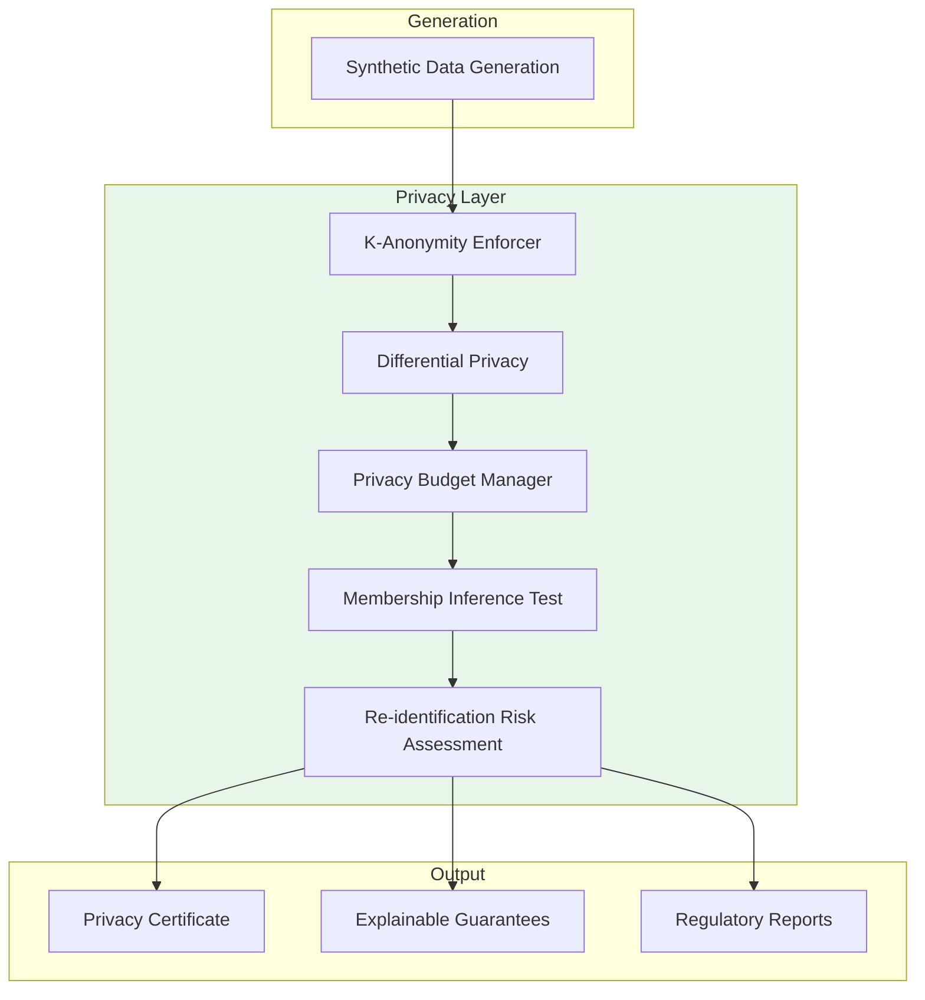

# Privacy & Compliance Framework

## Bank-Grade Privacy with Mathematical Guarantees

> **Protect customer data with provable privacy guarantees. Differential privacy, k-anonymity enforcement, membership inference testing, and privacy budget tracking—all in one integrated framework.**

---

## Overview

Pratibimba's privacy framework is designed for **regulatory compliance** and **mathematical rigor**. Unlike bolt-on privacy features, privacy is baked into every stage of the synthetic data pipeline:



---

## Privacy Technologies

### 1. Differential Privacy

**What it is:** A mathematical framework that limits what an adversary can learn about any individual in the dataset.

**The ε (epsilon) parameter:**
- Lower ε = stronger privacy, more noise
- Higher ε = weaker privacy, less noise

| ε Value | Privacy Level | Use Case |
|---------|---------------|----------|
| 0.1 | Maximum | Public release |
| 1.0 | Strong | GDPR anonymous data |
| 5.0 | Moderate | Internal analytics |
| 10.0 | Weak | Development only |

**Implementation:**
```python
from fintech.privacy.privacy_audit import PrivacyCertificateGenerator

generator = PrivacyCertificateGenerator()

# Generate certificate with ε=1.0 (strong privacy)
config = {
    "privacy_epsilon": 1.0,
    "k_anonymity": 5
}

certificate = generator.generate_certificate(
    original_df=original_data,
    synthetic_df=synthetic_data,
    config=config
)

print(f"Epsilon: {certificate['differential_privacy']['epsilon']}")
print(f"Privacy Level: {certificate['differential_privacy']['interpretation']}")
```

### 2. K-Anonymity Enforcement

**What it is:** Guarantee that every record is indistinguishable from at least k-1 other records based on quasi-identifiers.

**Why k ≥ 5 for banks:** Regulatory guidance (OCC, FDIC) considers k &lt; 5 as potentially re-identifiable.

**Automatic Enforcement:**
```python
from fintech.privacy.k_anonymity_enforcer import enforce_k_anonymity

# Enforce k >= 5
protected_df, report = enforce_k_anonymity(
    df=synthetic_data,
    target_k=5,
    quasi_identifiers=["age", "income", "state"]
)

print(f"Initial K: {report['initial_k']}")
print(f"Final K: {report['final_k']}")
print(f"Bank Compliant: {report['bank_compliant']}")
```

**Enforcement Strategies:**

| Strategy | Description | Data Impact |
|----------|-------------|-------------|
| Numerical Generalization | Age → age bands, Income → income bands | Moderate |
| Categorical Generalization | Group rare values into "Other" | Low |
| Micro-aggregation | Replace values with group means | Moderate |
| Record Suppression | Remove unique records | High (last resort) |

### 3. Membership Inference Testing

**What it is:** Simulated adversarial attack to test if an attacker can determine whether a specific record was in the training data.

**Pass Threshold:** Attack success rate &lt; 55% (close to random guessing at 50%)

**How it works:**
```python
from fintech.privacy.privacy_audit import MembershipInferenceTest

mia = MembershipInferenceTest()

results = mia.run_attack(
    original_data=train_data,
    synthetic_data=synthetic_data,
    sensitive_columns=["income", "credit_score"]
)

print(f"Attack Success Rate: {results['attack_success_rate']:.2%}")
print(f"Passed: {results['passed']}")  # True if < 55%
print(f"Interpretation: {results['interpretation']}")
```

**Attack Features:**
- Distance to nearest neighbor in original data
- Distance to nearest neighbor in synthetic data
- Likelihood scores based on statistical properties

### 4. Re-identification Risk Assessment

**What it is:** Analysis of quasi-identifiers to estimate the risk of linking synthetic records to real individuals.

```python
from fintech.privacy.privacy_audit import ReidentificationRiskAssessor

assessor = ReidentificationRiskAssessor()

risk = assessor.assess_risk(
    synthetic_data=synthetic_df,
    quasi_identifiers=["age", "state", "income"],
    population_size=1000000
)

print(f"Uniqueness Rate: {risk['uniqueness_rate']:.2%}")
print(f"K-Anonymity: {risk['k_anonymity']}")
print(f"Risk Level: {risk['risk_level']}")
```

### 5. Privacy Budget Manager

**What it is:** Real-time tracking of cumulative privacy spend with mathematically proven composition theorems.

**Why it matters:** Multiple queries on the same dataset compound privacy loss. Without tracking, you may unknowingly exceed safe limits.

**Composition Methods:**

| Method | Formula | Use Case |
|--------|---------|----------|
| Sequential | ε_total = Σε_i | Conservative, simple |
| Advanced (Kairouz 2015) | √(2k ln(1/δ)) × ε | Better for many queries |
| Rényi DP (Mironov 2017) | Optimal | Best for iterative training |

```python
from fintech.privacy.privacy_budget import PrivacyBudgetManager

# Initialize with total budget
manager = PrivacyBudgetManager(
    dataset_id="CREDIT_PORTFOLIO_2026",
    total_budget=10.0,
    warning_threshold=0.2,  # Warn at 20% remaining
    auto_pause=True  # Block when exhausted
)

# Consume budget for operations
success, msg = manager.consume(
    epsilon=1.0,
    operation="synthetic_generation",
    user="data_scientist@bank.com"
)

# Check status
status = manager.get_status()
print(f"Spent: ε={status.spent:.2f}")
print(f"Remaining: ε={status.remaining:.2f}")
print(f"Queries: {status.queries_count}")
```

---

## Privacy Certificates

After privacy processing, generate a **comprehensive privacy certificate** for audit trail:

```python
generator = PrivacyCertificateGenerator()

certificate = generator.generate_certificate(
    original_df=original_data,
    synthetic_df=synthetic_data,
    config={
        "privacy_epsilon": 1.0,
        "k_anonymity": 5
    }
)
```

### Certificate Contents

```json
{
  "certificate_id": "PRIV_20260202_163045_A1B2",
  "generated_at": "2026-02-02T16:30:45Z",
  
  "differential_privacy": {
    "epsilon": 1.0,
    "delta": 1e-5,
    "interpretation": "Strong privacy, limited information leakage",
    "passes_threshold": true
  },
  
  "k_anonymity": {
    "achieved_k": 8,
    "target_k": 5,
    "meets_requirement": true,
    "quasi_identifiers": ["age", "income", "state"]
  },
  
  "membership_inference": {
    "attack_success_rate": 0.523,
    "baseline_random": 0.50,
    "threshold": 0.55,
    "passed": true,
    "interpretation": "Excellent privacy - attack performance near random"
  },
  
  "reidentification_risk": {
    "uniqueness_rate": 0.0012,
    "risk_level": "very_low"
  },
  
  "regulatory_compliance": {
    "gdpr_anonymous": true,
    "ccpa_exempt": true,
    "hipaa_safe_harbor": true,
    "occ_compliant": true,
    "notes": [
      "✓ K-anonymity ≥ 5 meets HIPAA Safe Harbor",
      "✓ ε ≤ 1.0 qualifies as anonymous under GDPR",
      "✓ MIA success &lt; 55% indicates strong privacy"
    ]
  }
}
```

---

## API Endpoints

### Run Privacy Audit

```bash
curl -X POST http://localhost:8000/api/fintech/privacy-audit/SYNTH_20260202_163045_a1b2
```

**Response:**
```json
{
  "certificate_id": "PRIV_20260202_163045_A1B2",
  "differential_privacy": { ... },
  "k_anonymity": { ... },
  "membership_inference": { ... },
  "reidentification_risk": { ... },
  "regulatory_compliance": { ... }
}
```

### Get Privacy Certificate

```bash
curl http://localhost:8000/api/fintech/privacy-certificate/PRIV_20260202_163045_A1B2
```

### Check Privacy Budget

```bash
curl http://localhost:8000/api/fintech/privacy-budget/CREDIT_PORTFOLIO_2026
```

---

## Regulatory Compliance Matrix

| Regulation | Requirement | Pratibimba Support |
|------------|-------------|-------------------|
| **GDPR (EU)** | Anonymous data exempt from regulation | ε ≤ 1.0 = anonymous |
| **CCPA (California)** | De-identified data provisions | k ≥ 5 = de-identified |
| **HIPAA (US Healthcare)** | Safe Harbor de-identification | k ≥ 5, ε ≤ 1.0 |
| **OCC SR 11-7** | Model risk documentation | Audit trail + certificates |
| **FDIC MRMG** | Model governance | Privacy certificates |
| **UK PRA SS1/23** | Stress testing requirements | Full compliance |
| **GLBA (US)** | Financial privacy | K-anonymity enforcement |

---

## Best Practices

### 1. Start with Strong Privacy Settings

```json
{
  "privacy_epsilon": 1.0,
  "k_anonymity": 5
}
```

These are safe defaults that satisfy most regulatory requirements.

### 2. Always Run Privacy Audits

Include privacy audit in your generation workflow:

```bash
# 1. Generate portfolio
curl -X POST .../generate-portfolio ...

# 2. Run privacy audit
curl -X POST .../privacy-audit/{portfolio_id}

# 3. Check certificate
curl .../privacy-certificate/{certificate_id}
```

### 3. Monitor Privacy Budget

For datasets with multiple queries, track cumulative spend:

```python
manager = PrivacyBudgetManager(
    dataset_id="SENSITIVE_PORTFOLIO",
    total_budget=10.0,
    auto_pause=True
)

# Budget will automatically block operations at exhaustion
```

### 4. Document for Regulators

Keep privacy certificates for audit trail:

```python
# Save certificate to file
with open(f"audit/privacy_{certificate_id}.json", "w") as f:
    json.dump(certificate, f, indent=2)
```

---

## Related Documentation

- [XPrivacy: Explainable Privacy →](./xprivacy-explainability.md) - Natural language explanations
- [Regulatory Reports →](./regulatory-reports.md) - OCC/FDIC/PRA templates
- [Digital Twin Cloning →](./digital-twin-cloning.md) - K-anonymity in cloning
- [API Reference →](./api-reference.md) - Complete API documentation
