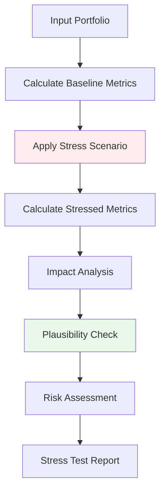

# Economic Stress Testing

## Simulate Crisis Scenarios on Synthetic Portfolios

> **Test portfolio resilience across economic stress scenarios: recessions, rate shocks, unemployment spikes, and housing crashes. Pre-built scenarios with plausibility validation against historical data.**

---

## Overview

Financial regulators (OCC, FDIC, PRA, Federal Reserve) require banks to stress test their credit portfolios under adverse economic conditions. Pratibimba's **Stress Test Engine** enables:

1. **Scenario Simulation** - Apply pre-built or custom stress scenarios
2. **Impact Analysis** - Compare baseline vs. stressed metrics
3. **Plausibility Validation** - Verify results against historical benchmarks
4. **Comparative Testing** - Compare original vs. synthetic portfolio response

---

## Pre-Built Scenarios

| Scenario | Default Rate Multiplier | Recovery Reduction | Rate Change | Based On |
|----------|------------------------|-------------------|-------------|----------|
| **Mild Recession** | 1.5x | 10% | +50 bps | 2001 recession |
| **Severe Recession** | 3.0x | 30% | +100 bps | 2008 financial crisis |
| **Rate Shock** | 1.2x | 5% | +300 bps | 1980s Volcker shock |
| **Unemployment Spike** | 2.5x | 25% | +75 bps | COVID-19 impact |
| **Housing Crash** | 2.8x | 35% | +50 bps | 2007-2008 housing crisis |

---

## How It Works



### Stress Application Logic

```python
def _apply_stress_scenario(self, portfolio, scenario):
    """Apply economic stress to portfolio."""
    
    # 1. Adjust default probabilities
    stressed_portfolio = portfolio.copy()
    stressed_portfolio['default_prob'] *= scenario.default_rate_multiplier
    
    # 2. Reduce recovery rates
    stressed_portfolio['recovery_rate'] *= (1 - scenario.recovery_rate_reduction)
    
    # 3. Adjust interest rates
    stressed_portfolio['interest_rate'] += scenario.interest_rate_change
    
    # 4. Recalculate expected losses
    stressed_portfolio['expected_loss'] = (
        stressed_portfolio['principal'] *
        stressed_portfolio['default_prob'] *
        (1 - stressed_portfolio['recovery_rate'])
    )
    
    return stressed_portfolio
```

---

## Usage

### Python API

```python
from fintech.validation.stress_test import StressTestEngine
import pandas as pd

# Initialize engine
engine = StressTestEngine()

# Load portfolio
portfolio_df = pd.read_csv("synthetic_portfolio.csv")

# Run stress test
result = engine.run_stress_test(
    portfolio_df=portfolio_df,
    scenario="severe_recession"
)

print(f"Scenario: {result['scenario']}")
print(f"\nBaseline Metrics:")
print(f"  Default Rate: {result['baseline']['default_rate']:.2%}")
print(f"  Expected Loss: ${result['baseline']['expected_loss']:,.0f}")

print(f"\nStressed Metrics:")
print(f"  Default Rate: {result['stressed']['default_rate']:.2%}")
print(f"  Expected Loss: ${result['stressed']['expected_loss']:,.0f}")

print(f"\nImpact:")
print(f"  Default Rate Increase: {result['impact']['default_rate_increase']:.2%}")
print(f"  Loss Increase: {result['impact']['loss_increase_pct']:.1f}%")
```

### REST API

```bash
curl -X POST http://localhost:8000/api/fintech/stress-test \
  -H "Content-Type: application/json" \
  -d '{
    "portfolio_id": "SYNTH_20260202_163045_a1b2",
    "scenario": "severe_recession",
    "compare_with_original": "ORIG_20260202_163045_a1b2"
  }'
```

**Response:**

```json
{
  "stress_test_id": "STRESS_20260202_163045_a1b2",
  "scenario": "severe_recession",
  "scenario_description": "2008-style financial crisis",
  
  "baseline_metrics": {
    "default_rate": 0.035,
    "expected_loss": 1250000,
    "total_principal": 50000000,
    "weighted_avg_rate": 0.12,
    "portfolio_yield": 0.092
  },
  
  "stressed_metrics": {
    "default_rate": 0.105,
    "expected_loss": 3675000,
    "recovery_rate": 0.28,
    "loss_given_default": 0.72,
    "net_yield": -0.021
  },
  
  "impact_analysis": {
    "default_rate_increase": 0.070,
    "default_rate_multiplier": 3.0,
    "loss_increase_absolute": 2425000,
    "loss_increase_percent": 194.0,
    "yield_impact": -0.113,
    "capital_at_risk": 0.0485
  },
  
  "plausibility_check": {
    "passed": true,
    "expected_range": [2.0, 4.0],
    "actual_multiplier": 3.0,
    "historical_benchmark": "2008 crisis saw 2.5-4.5x default increase"
  },
  
  "risk_assessment": {
    "severity": "high",
    "capital_adequacy_note": "Recommend 8.5% capital buffer for this stress level",
    "recommendations": [
      "Consider reducing exposure to E-grade borrowers",
      "Increase loss reserves by 150%",
      "Review concentration in high-LTV segments"
    ]
  }
}
```

---

## Scenario Details

### Mild Recession (2001-style)

```python
MILD_RECESSION = StressScenario(
    name="Mild Recession",
    description="2001-style economic downturn",
    default_rate_multiplier=1.5,
    recovery_rate_reduction=0.10,
    interest_rate_change=0.005,  # +50 bps
    unemployment_assumption=0.065,
    gdp_decline=-0.015
)
```

**Expected Impact:**
- Default rates: 1.5x baseline
- Recovery rates: 10% lower
- Duration: 12-18 months

### Severe Recession (2008-style)

```python
SEVERE_RECESSION = StressScenario(
    name="Severe Recession",
    description="2008-style financial crisis",
    default_rate_multiplier=3.0,
    recovery_rate_reduction=0.30,
    interest_rate_change=0.01,  # +100 bps
    unemployment_assumption=0.10,
    gdp_decline=-0.04
)
```

**Expected Impact:**
- Default rates: 3x baseline
- Recovery rates: 30% lower
- Duration: 24-36 months

### Interest Rate Shock

```python
RATE_SHOCK = StressScenario(
    name="Rate Shock",
    description="1980s-style rate tightening",
    default_rate_multiplier=1.2,
    recovery_rate_reduction=0.05,
    interest_rate_change=0.03,  # +300 bps
    unemployment_assumption=0.07,
    gdp_decline=-0.02
)
```

**Expected Impact:**
- Adjustable-rate loans: immediate payment stress
- Fixed-rate originations: reduced volume
- Refinance defaults: increased

### Unemployment Spike

```python
UNEMPLOYMENT_SPIKE = StressScenario(
    name="Unemployment Spike",
    description="COVID-19-style labor shock",
    default_rate_multiplier=2.5,
    recovery_rate_reduction=0.25,
    interest_rate_change=0.0075,  # +75 bps
    unemployment_assumption=0.14,
    gdp_decline=-0.03
)
```

**Expected Impact:**
- Personal loans: highest impact
- Secured loans: moderate impact
- Government-backed: lowest impact

### Housing Market Crash

```python
HOUSING_CRASH = StressScenario(
    name="Housing Crash",
    description="2007-2008 housing crisis",
    default_rate_multiplier=2.8,
    recovery_rate_reduction=0.35,
    interest_rate_change=0.005,  # +50 bps
    unemployment_assumption=0.09,
    home_price_decline=0.30
)
```

**Expected Impact:**
- Mortgage defaults: 3-4x increase
- High-LTV loans: highest losses
- Recovery rates: severely impacted by collateral decline

---

## Plausibility Validation

The engine validates that stress results are **plausible** based on historical data:

```python
def _check_plausibility(self, baseline, stressed, scenario):
    """Validate results against historical benchmarks."""
    
    actual_multiplier = stressed['default_rate'] / baseline['default_rate']
    
    # Expected ranges based on historical observation
    expected_ranges = {
        "mild_recession": (1.2, 2.0),
        "severe_recession": (2.0, 4.0),
        "rate_shock": (1.0, 1.5),
        "unemployment_spike": (2.0, 3.5),
        "housing_crash": (2.0, 4.5)
    }
    
    min_expected, max_expected = expected_ranges[scenario]
    passed = min_expected <= actual_multiplier <= max_expected
    
    return {
        "passed": passed,
        "expected_range": (min_expected, max_expected),
        "actual_multiplier": actual_multiplier,
        "note": f"{'Within' if passed else 'Outside'} historical range"
    }
```

---

## Comparative Analysis

Compare how original vs. synthetic portfolios respond to stress:

```python
result = engine.run_stress_test(
    portfolio_df=synthetic_portfolio,
    scenario="severe_recession",
    compare_with=original_portfolio
)

print(f"Original Stressed Default Rate: {result['comparison']['original_stressed']:.2%}")
print(f"Synthetic Stressed Default Rate: {result['comparison']['synthetic_stressed']:.2%}")
print(f"Difference: {result['comparison']['difference']:.4f}")
print(f"Correlation of Response: {result['comparison']['correlation']:.4f}")
```

This validates that the synthetic portfolio **behaves similarly** to the original under stress—a critical quality metric.

---

## Custom Scenarios

Define your own stress scenarios:

```python
from fintech.validation.stress_test import StressScenario, StressTestEngine

# Define custom scenario
pandemic_v2 = StressScenario(
    name="Pandemic Shock v2",
    description="Severe pandemic with prolonged lockdown",
    default_rate_multiplier=3.5,
    recovery_rate_reduction=0.40,
    interest_rate_change=-0.005,  # Rate cut
    unemployment_assumption=0.18,
    gdp_decline=-0.08
)

# Run with custom scenario
engine = StressTestEngine()
engine.add_scenario("pandemic_v2", pandemic_v2)

result = engine.run_stress_test(
    portfolio_df=portfolio,
    scenario="pandemic_v2"
)
```

---

## Risk Assessment Output

The engine provides actionable risk assessment:

```json
{
  "risk_assessment": {
    "severity": "high",
    "capital_buffer_recommendation": "8.5%",
    "reserve_increase_recommendation": "150%",
    "concentration_warnings": [
      "High exposure to subprime segment (25% of portfolio)",
      "Geographic concentration in California (40%)"
    ],
    "mitigation_actions": [
      "Consider credit tightening for D/E grade originations",
      "Increase loss reserve coverage ratio",
      "Diversify geographic exposure",
      "Review underwriting criteria for high-DTI applicants"
    ]
  }
}
```

---

## Regulatory Alignment

| Regulation | Stress Testing Requirement | Pratibimba Support |
|------------|---------------------------|-------------------|
| **CCAR** | Severely Adverse scenario | Severe Recession |
| **DFAST** | Baseline, Adverse, Severely Adverse | All 5 scenarios |
| **PRA SS1/23** | Reverse stress testing | Custom scenarios |
| **Basel III** | Stressed PD/LGD | All scenarios |
| **OCC SR 11-7** | Model stress testing | Comparative analysis |

---

## Integration with Reports

Stress test results are automatically included in regulatory reports:

```python
from fintech.validation.fidelity_report import FidelityReportGenerator

reporter = FidelityReportGenerator()

report = reporter.generate_report(
    data_stats=stats,
    validation_results=validation,
    stress_test_results=stress_results,
    regulatory_template="occ"  # or "fdic", "pra"
)
```

---

## Related Documentation

- [Validation & Quality →](./validation-quality.md) - Baseline quality metrics
- [Regulatory Reports →](./regulatory-reports.md) - Compliance documentation
- [Credit Portfolio Generator →](./credit-portfolio-generator.md) - Generation settings
- [API Reference →](./api-reference.md) - Complete API documentation
