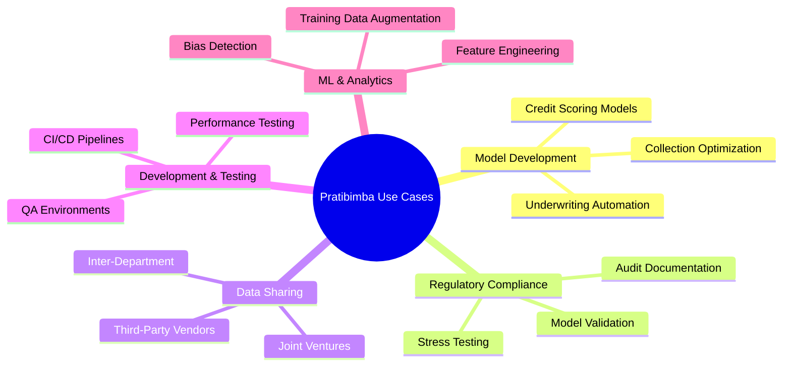

# Enterprise Use Cases

## Real-World Applications for Synthetic Credit Data

> **From model development to regulatory compliance, discover how leading financial institutions leverage Pratibimba for production-critical workloads.**

---

## Use Case Categories



---

## 1. Model Development & Validation

### Credit Scoring Model Training

**Challenge:** Develop new credit scoring models without exposing customer PII to data scientists.

**Solution:** Generate synthetic training data that preserves:
- Credit score distributions
- Default rate patterns
- Feature correlations

```python
# Generate training data for credit model
config = PortfolioGenerationConfig(
    num_borrowers=100000,
    target_default_rate=0.035,
    include_payment_history=True,
    history_months=36
)

portfolio = generator.generate_portfolio(config)
borrowers_df, loans_df = generator.portfolio_to_dataframe(portfolio)

# Train your model on synthetic data
from sklearn.ensemble import GradientBoostingClassifier
model = GradientBoostingClassifier()
model.fit(borrowers_df[features], borrowers_df['default'])
```

**Validation:**
- Gini coefficient preserved within 0.01
- Feature importance rankings maintained
- Model performance comparable on holdout

---

### Collections Model Optimization

**Challenge:** Train collections models that predict cure probability for delinquent accounts.

**Solution:** Use LSTM cascade engine to generate realistic delinquency patterns:

```python
# Generate payment sequences with cascade effects
lstm = LSTMCascadeGenerator()

sequences = lstm.generate_sequences(
    borrowers=borrowers_df,
    num_months=18,
    initial_status="30_days"
)

# Train cure prediction model
# Synthetic data captures: "30 days → cure" vs "30 days → 60 days → charge-off"
```

**Key Benefit:** LSTM captures temporal dynamics that i.i.d. sampling destroys.

---

### Underwriting Model Development

**Challenge:** Test new underwriting criteria without affecting production systems.

**Solution:** Generate synthetic applications with known outcomes:

```python
# Generate applicant pool with varied risk profiles
config = PortfolioGenerationConfig(
    num_borrowers=50000,
    risk_grade_distribution={
        "A": 0.15,  # Prime
        "B": 0.20,
        "C": 0.30,  # Target segment
        "D": 0.25,  # Subprime
        "E": 0.10   # Deep subprime
    }
)

# Test different approval thresholds
# Measure predicted default rates vs actual
```

---

## 2. Regulatory Compliance

### CCAR/DFAST Stress Testing

**Challenge:** Stress test credit portfolios under Severely Adverse scenario per Federal Reserve requirements.

**Solution:** Use built-in stress testing with CCAR-aligned scenarios:

```python
from fintech.validation.stress_test import StressTestEngine

engine = StressTestEngine()

# Run CCAR Severely Adverse scenario
result = engine.run_stress_test(
    portfolio_df=synthetic_portfolio,
    scenario="severe_recession"  # 2008-style
)

# Get capital impact
print(f"Stressed Default Rate: {result['stressed']['default_rate']:.1%}")
print(f"Capital at Risk: {result['impact_analysis']['capital_at_risk']:.1%}")
```

**Regulatory Templates:** OCC SR 11-7 documentation generated automatically.

---

### Model Risk Management (OCC SR 11-7)

**Challenge:** Document model validation for regulatory review per OCC guidance.

**Solution:** Generate comprehensive fidelity reports:

```python
reporter = FidelityReportGenerator()

report = reporter.generate_report(
    portfolio_id=portfolio_id,
    validation_results=validation,
    privacy_certificate=certificate,
    stress_test_results=stress,
    format="pdf",
    regulatory_template="occ"
)

# Outputs: Professional PDF ready for OCC submission
```

**Included Sections:**
- Model identification and ownership
- Conceptual soundness evaluation
- Validation independence attestation
- Ongoing monitoring plan

---

### Privacy Compliance (GDPR/CCPA)

**Challenge:** Create datasets that qualify as anonymous under GDPR and de-identified under CCPA.

**Solution:** Enforce privacy thresholds with proof:

```python
# Enforce GDPR-compliant privacy
certificate = generator.generate_certificate(
    original_df=original,
    synthetic_df=synthetic,
    config={
        "privacy_epsilon": 1.0,  # GDPR anonymous threshold
        "k_anonymity": 5         # Re-identification protection
    }
)

# Check compliance status
print(f"GDPR Anonymous: {certificate['regulatory_compliance']['gdpr_anonymous']}")
print(f"CCPA Exempt: {certificate['regulatory_compliance']['ccpa_exempt']}")
```

**Audit Trail:** All decisions logged with immutable SHA-256 hashes.

---

## 3. Third-Party Data Sharing

### Vendor Model Development

**Challenge:** Fintech vendor needs your data to build custom model, but you can't share customer PII.

**Solution:** Clone your production data into a privacy-safe twin:

```bash
# 1. Upload production data
curl -X POST /api/fintech/upload-data -F "file=@production_portfolio.csv"

# 2. Generate twin with privacy guarantees
curl -X POST /api/fintech/clone-portfolio -d '{
    "file_id": "RAW_...",
    "num_samples": 100000
}'

# 3. Get privacy certificate for DPA
curl /api/fintech/privacy-certificate/PRIV_...
```

**Deliverables to Vendor:**
- Synthetic dataset (preserved correlations)
- Privacy certificate (legal protection)
- Quality report (equivalent to production data)

---

### Inter-Departmental Sharing

**Challenge:** Risk team needs credit data but doesn't have PII access per internal policy.

**Solution:** Generate synthetic data for their use case:

```python
# Risk team needs to analyze subprime segment
config = PortfolioGenerationConfig(
    num_borrowers=25000,
    risk_grade_distribution={
        "D": 0.60,  # Focus on subprime
        "E": 0.40
    },
    target_default_rate=0.18
)

# Generate and validate
portfolio = generator.generate_portfolio(config)
validation = validator.validate_portfolio(reference_df, synthetic_df)

# Share with risk team
```

---

### Joint Venture Analytics

**Challenge:** JV partner needs portfolio analytics but contractual restrictions prevent data sharing.

**Solution:** Share synthetic twin with equivalent statistical properties:

```python
# Clone production data
cloner = DigitalTwinCloner()
model_id, _ = cloner.train(production_df)
synthetic_df = cloner.generate(model_id, num_samples=len(production_df))

# Validate equivalence
comparison = cloner.get_comparison(production_df, synthetic_df)
print(f"Similarity: {comparison['similarity_score']:.1f}%")

# Generate XPrivacy report for JV partner's legal team
explanation = explainer.explain_certificate(certificate)
```

---

## 4. Development & Testing

### QA Environment Population

**Challenge:** QA needs production-representative data but cannot use real customer data.

**Solution:** Generate refreshable synthetic data:

```python
# Generate QA dataset
config = PortfolioGenerationConfig(
    num_borrowers=50000,
    target_default_rate=0.035
)

portfolio = generator.generate_portfolio(config)

# Export to QA database
borrowers_df.to_sql("borrowers", qa_connection)
loans_df.to_sql("loans", qa_connection)
```

**Benefits:**
- Deterministic (seeded) for reproducible tests
- No PII concerns
- Refreshable on demand

---

### Performance Testing

**Challenge:** Load test credit decisioning system with realistic traffic.

**Solution:** Generate millions of synthetic applications:

```python
# Generate high volume for load testing
config = PortfolioGenerationConfig(
    num_borrowers=1000000,  # 1M borrowers
    include_payment_history=False  # Faster generation
)

# Export for JMeter/Locust
portfolio = generator.generate_portfolio(config)
```

---

### CI/CD Integration

**Challenge:** Automated tests need stable, realistic data fixtures.

**Solution:** Generate fixtures as part of CI pipeline:

```yaml
# .github/workflows/test.yml
jobs:
  test:
    steps:
      - name: Generate test fixtures
        run: |
          curl -X POST http://localhost:8000/api/fintech/generate-portfolio \
            -d '{"num_borrowers": 1000}'
          
      - name: Run tests
        run: pytest tests/
```

---

## 5. ML & Analytics

### Training Data Augmentation

**Challenge:** Limited historical default data for rare risk segments.

**Solution:** Generate additional samples for underrepresented segments:

```python
# Augment E-grade (deep subprime) samples
config = PortfolioGenerationConfig(
    num_borrowers=10000,
    risk_grade_distribution={"E": 1.0},  # 100% E-grade
    target_default_rate=0.30
)

augmented = generator.generate_portfolio(config)

# Combine with real data for training
combined_df = pd.concat([real_df, augmented_df])
```

---

### Bias Detection

**Challenge:** Test if credit model has disparate impact across protected classes.

**Solution:** Generate synthetic populations with controlled demographics:

```python
# Generate balanced demographic groups
for demographic in ["Group_A", "Group_B", "Group_C"]:
    config = PortfolioGenerationConfig(
        num_borrowers=10000,
        demographic_override=demographic
    )
    portfolio = generator.generate_portfolio(config)
    
    # Test model predictions
    predictions = model.predict(portfolio)
    
    # Check for disparate impact
    approval_rate = predictions.mean()
    print(f"{demographic}: {approval_rate:.1%} approval rate")
```

---

### Feature Engineering R&D

**Challenge:** Experiment with new features without affecting production data.

**Solution:** Generate synthetic data with varied feature configurations:

```python
# Test different feature combinations
for dti_range in [(0.2, 0.3), (0.3, 0.4), (0.4, 0.5)]:
    config = PortfolioGenerationConfig(
        num_borrowers=5000,
        dti_range=dti_range
    )
    
    portfolio = generator.generate_portfolio(config)
    
    # Evaluate feature impact on default prediction
    default_rate = portfolio.default_rate
    print(f"DTI {dti_range}: {default_rate:.2%} default rate")
```

---

## Case Study Summary

| Use Case | Primary Benefit | Key Feature Used |
|----------|-----------------|------------------|
| Credit scoring | Train without PII | Correlation preservation |
| Collections models | Realistic cascades | LSTM engine |
| Stress testing | Regulatory compliance | Stress scenarios |
| Model documentation | Audit readiness | Regulatory reports |
| Vendor sharing | Legal protection | Privacy certificates |
| QA environments | No PII risk | Full generation |
| Performance testing | Scale simulation | High-volume generation |
| Bias detection | Controlled experiments | Demographic controls |

---

## Getting Started

1. **Identify your use case** from the categories above
2. **Review relevant documentation** for technical details
3. **Generate a sample portfolio** to validate fit
4. **Run validation** to ensure quality meets requirements
5. **Deploy to production** with confidence

---

## Related Documentation

- [Credit Portfolio Generator →](./credit-portfolio-generator.md) - Generation details
- [Digital Twin Cloning →](./digital-twin-cloning.md) - Clone production data
- [Privacy Guarantees →](./privacy-guarantees.md) - Compliance documentation
- [Stress Testing →](./stress-testing.md) - Regulatory scenarios
- [API Reference →](./api-reference.md) - Complete API documentation
