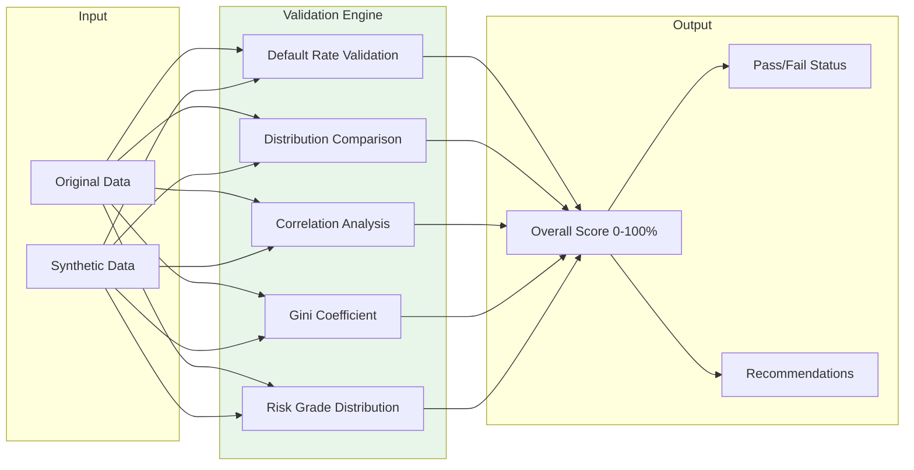

# Statistical Validation & Quality Assurance

## Rigorous Validation for Production-Ready Synthetic Data

> **Verify that your synthetic data preserves essential statistical properties. Gini coefficients, KS tests, KL divergence, correlation analysis—all with automated pass/fail scoring and actionable recommendations.**

---

## Overview

Synthetic data is only useful if it **behaves like real data**. Pratibimba's validation framework provides comprehensive statistical comparison between original and synthetic datasets.



---

## Validation Metrics

### 1. Default Rate Validation

Ensures synthetic data matches target default rate within tolerance.

| Metric | Description | Pass Threshold |
|--------|-------------|----------------|
| `default_rate_error` | \|achieved - target\| | ≤ 1.0% |
| `rate_match_ratio` | achieved / target | 0.9 - 1.1 |

```python
from fintech.validation.credit_metrics import CreditMetricsValidator

validator = CreditMetricsValidator()

result = validator.validate_default_rate(
    original_df=original,
    synthetic_df=synthetic,
    target_column="status",
    target_value="default"
)

print(f"Original Rate: {result['original_rate']:.2%}")
print(f"Synthetic Rate: {result['synthetic_rate']:.2%}")
print(f"Error: {result['default_rate_error']:.4f}")
print(f"Passed: {result['passed']}")
```

### 2. Distribution Comparison (KS Test)

Kolmogorov-Smirnov test for each numeric column.

| Metric | Description | Pass Threshold |
|--------|-------------|----------------|
| `ks_statistic` | Max CDF difference | < 0.1 |
| `p_value` | Statistical significance | > 0.05 |

```python
result = validator.validate_distributions(original, synthetic)

for col, metrics in result['column_metrics'].items():
    print(f"{col}: KS={metrics['ks_statistic']:.4f}, p={metrics['p_value']:.4f}")
```

### 3. KL Divergence

Information-theoretic measure of distribution similarity.

| Metric | Description | Pass Threshold |
|--------|-------------|----------------|
| `kl_divergence` | Bits of difference | < 0.5 |
| `symmetric_kl` | (KL(P\|\|Q) + KL(Q\|\|P)) / 2 | < 0.3 |

```python
result = validator.validate_kl_divergence(original, synthetic)

for col, kl in result['per_column'].items():
    print(f"{col}: KL={kl:.4f}")
print(f"Average KL: {result['average_kl']:.4f}")
```

### 4. Correlation Matrix Comparison

Ensures correlation structure is preserved.

| Metric | Description | Pass Threshold |
|--------|-------------|----------------|
| `frobenius_error` | Matrix norm difference | < 0.2 |
| `max_abs_error` | Largest single correlation difference | < 0.15 |
| `average_error` | Mean absolute correlation difference | < 0.1 |

```python
result = validator.validate_correlations(original, synthetic)

print(f"Frobenius Error: {result['frobenius_error']:.4f}")
print(f"Max Error: {result['max_abs_error']:.4f}")
print(f"Passed: {result['passed']}")
```

### 5. Gini Coefficient Comparison

Validates that synthetic data maintains the same predictive power for credit scoring.

| Metric | Description | Pass Threshold |
|--------|-------------|----------------|
| `gini_original` | Gini on original data | - |
| `gini_synthetic` | Gini on synthetic data | - |
| `gini_difference` | \|original - synthetic\| | < 0.05 |

```python
result = validator.validate_gini(
    original,
    synthetic,
    score_column="credit_score",
    target_column="status"
)

print(f"Original Gini: {result['gini_original']:.4f}")
print(f"Synthetic Gini: {result['gini_synthetic']:.4f}")
print(f"Difference: {result['gini_difference']:.4f}")
```

### 6. Risk Grade Distribution

Compares distribution across credit risk grades.

```python
result = validator.validate_risk_distribution(
    original,
    synthetic,
    grade_column="risk_grade"
)

for grade in ['A', 'B', 'C', 'D', 'E']:
    orig_pct = result['original_distribution'].get(grade, 0)
    synth_pct = result['synthetic_distribution'].get(grade, 0)
    print(f"{grade}: Original={orig_pct:.1%}, Synthetic={synth_pct:.1%}")
```

---

## Complete Validation

Run all validations in one call:

```python
from fintech.validation.credit_metrics import CreditMetricsValidator

validator = CreditMetricsValidator()

report = validator.validate_portfolio(
    original_df=original,
    synthetic_df=synthetic,
    target_column="status",
    target_value="default"
)

print(f"Overall Score: {report['overall_score']:.1f}/100")
print(f"Passed: {report['passed']}")
print(f"\nMetrics:")
for metric, value in report['metrics'].items():
    print(f"  {metric}: {value}")
print(f"\nRecommendations:")
for rec in report['recommendations']:
    print(f"  - {rec}")
```

### Example Output

```json
{
  "overall_score": 87.5,
  "passed": true,
  "metrics": {
    "default_rate_validation": {
      "original_rate": 0.0342,
      "synthetic_rate": 0.0358,
      "error": 0.0016,
      "passed": true
    },
    "distribution_validation": {
      "avg_ks_statistic": 0.045,
      "columns_passed": 12,
      "columns_failed": 1,
      "passed": true
    },
    "correlation_validation": {
      "frobenius_error": 0.089,
      "max_error": 0.12,
      "passed": true
    },
    "gini_validation": {
      "original_gini": 0.423,
      "synthetic_gini": 0.415,
      "difference": 0.008,
      "passed": true
    },
    "risk_distribution_validation": {
      "chi_square": 4.23,
      "p_value": 0.38,
      "passed": true
    }
  },
  "recommendations": [
    "✓ Default rate within tolerance (3.58% vs 3.42% target)",
    "⚠ Consider reviewing 'income' distribution (KS=0.12)",
    "✓ Correlation structure well-preserved",
    "✓ Gini coefficient difference < 0.01"
  ]
}
```

---

## Scoring System

### Overall Score Calculation

```
Overall Score = (
    0.25 × Default Rate Score +
    0.25 × Distribution Score +
    0.20 × Correlation Score +
    0.15 × Gini Score +
    0.15 × Risk Distribution Score
)
```

### Pass/Fail Thresholds

| Score Range | Status | Interpretation |
|-------------|--------|----------------|
| 90-100 | ✅ Excellent | Production-ready |
| 75-89 | ✅ Good | Suitable for most use cases |
| 60-74 | ⚠️ Acceptable | Review recommendations |
| 40-59 | ❌ Poor | Significant discrepancies |
| < 40 | ❌ Failed | Regenerate with different settings |

---

## API Usage

### REST API

```bash
curl -X POST http://localhost:8000/api/fintech/validate \
  -H "Content-Type: application/json" \
  -d '{
    "original_portfolio_id": "ORIG_20260202_163045_a1b2",
    "synthetic_portfolio_id": "SYNTH_20260202_163045_a1b2",
    "target_column": "status",
    "target_value": "default",
    "run_privacy_audit": true
  }'
```

**Response:**

```json
{
  "validation_id": "VAL_20260202_163045_a1b2",
  "overall_score": 87.5,
  "passed": true,
  "metrics": { ... },
  "recommendations": [ ... ],
  "privacy_certificate_id": "PRIV_20260202_163045_a1b2"
}
```

---

## Automatic Recommendations

The validator generates actionable recommendations based on results:

| Issue Detected | Recommendation |
|----------------|----------------|
| High default rate error | "Adjust risk_grade_distribution to match target" |
| KS test failure | "Column '{col}' shows distribution shift - review marginals" |
| Correlation error > 0.15 | "Enable copulas for better correlation preservation" |
| Gini difference > 0.05 | "Increase sample size or review generation parameters" |
| Risk distribution mismatch | "Verify risk_grade_distribution config matches original" |

---

## Integration with Reports

Validation results are automatically included in fidelity reports:

```python
from fintech.validation.fidelity_report import FidelityReportGenerator

reporter = FidelityReportGenerator()

report = reporter.generate_report(
    data_stats={"num_records": 10000},
    validation_results=validation_report,
    privacy_certificate=certificate
)

# Generates PDF with validation metrics, charts, and recommendations
```

---

## Best Practices

### 1. Always Validate Before Use

```python
# Generate → Validate → Use
portfolio = generator.generate_portfolio(config)
validation = validator.validate_portfolio(original, synthetic)

if not validation['passed']:
    raise ValueError("Synthetic data quality insufficient")
```

### 2. Compare Against Actual Original Data

When possible, validate against the actual original dataset, not a reference dataset:

```python
# Best: Use actual original data
original_df = pd.read_csv("production_data.csv")

# If original unavailable, use holdout sample
original_df = synthetic_df.sample(frac=0.8)  # Less reliable
```

### 3. Focus on Business-Critical Metrics

Customize validation weights for your use case:

```python
# For credit scoring models, prioritize Gini
validator = CreditMetricsValidator(
    weights={
        "default_rate": 0.20,
        "distribution": 0.15,
        "correlation": 0.20,
        "gini": 0.30,  # Higher weight
        "risk_distribution": 0.15
    }
)
```

### 4. Track Validation History

Store validation results for audit trail:

```python
# Results are automatically persisted to database
# Query historical validations:
curl http://localhost:8000/api/fintech/validations?portfolio_id=SYNTH_...
```

---

## Related Documentation

- [Credit Portfolio Generator →](./credit-portfolio-generator.md) - Generation settings that affect quality
- [Stress Testing →](./stress-testing.md) - Validate behavior under stress
- [Regulatory Reports →](./regulatory-reports.md) - Include validation in compliance docs
- [API Reference →](./api-reference.md) - Complete API documentation
