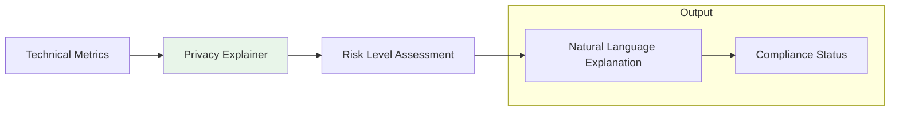

# XPrivacy: Explainable Privacy

## Bridging the Gap Between Engineers and Legal Teams

> **Translate technical privacy parameters (ε, δ, k) into natural language that compliance officers, legal counsel, and regulators can understand. This is a killer differentiator—no competitor offers this.**

---

## The Problem

Privacy engineers speak in mathematical terms:
- "We achieved ε=0.8 with δ=1e-5"
- "K-anonymity is 12 across the quasi-identifier set"
- "MIA success rate is 52.3%"

Compliance officers and lawyers ask:
- "Is this data safe to share with our vendor?"
- "Does this meet GDPR requirements?"
- "Can someone identify a customer from this data?"

**XPrivacy translates between these two worlds.**

---

## How It Works



The `PrivacyExplainer` class converts raw metrics into:
1. **Risk Level** (VERY_LOW → CRITICAL)
2. **Headline** (one-line summary)
3. **Explanation** (2-3 paragraph business-friendly description)
4. **Recommendation** (actionable guidance)
5. **Compliance Status** (GDPR, CCPA, HIPAA, OCC checkboxes)

---

## Usage

### Python API

```python
from fintech.privacy.explainability import PrivacyExplainer

explainer = PrivacyExplainer()

# Explain epsilon value
explanation = explainer.explain_epsilon(epsilon=0.8)

print(f"Risk Level: {explanation.risk_level}")
print(f"Headline: {explanation.headline}")
print(f"Explanation: {explanation.explanation}")
print(f"Recommendation: {explanation.recommendation}")
print(f"GDPR Compliant: {explanation.compliance_status['gdpr_anonymous']}")
```

**Output:**
```
Risk Level: low
Headline: Strong Privacy Protection
Explanation: The synthetic data provides strong privacy guarantees. 
Any attacker would gain minimal information about specific individuals, 
even with sophisticated statistical attacks. This meets academic 
standards for differential privacy. (Technical: ε=0.80, δ=1e-05)
Recommendation: Suitable for sharing with trusted third parties.
GDPR Compliant: True
```

### Convenience Function

```python
from fintech.privacy.explainability import explain_privacy_guarantee

result = explain_privacy_guarantee(
    epsilon=1.0,
    k_anonymity=8,
    mia_rate=0.52
)

# Returns dict with explanations for all provided metrics
```

---

## Epsilon Explanations

| ε Value | Risk Level | Headline | Recommendation |
|---------|------------|----------|----------------|
| ≤ 0.1 | VERY_LOW | Maximum Privacy Protection | Safe for public release |
| ≤ 1.0 | LOW | Strong Privacy Protection | Suitable for trusted third parties |
| ≤ 5.0 | MEDIUM | Standard Privacy Protection | Internal use and controlled sharing |
| ≤ 10.0 | HIGH | Limited Privacy Protection | Internal use only |
| > 10.0 | CRITICAL | Privacy Warning - High Risk | DO NOT SHARE |

### Example: Strong Privacy (ε = 0.5)

```json
{
  "risk_level": "low",
  "headline": "Strong Privacy Protection",
  "explanation": "The synthetic data provides strong privacy guarantees. Any attacker would gain minimal information about specific individuals, even with sophisticated statistical attacks. This meets academic standards for differential privacy.",
  "recommendation": "Suitable for sharing with trusted third parties.",
  "technical_summary": {
    "epsilon": 0.5,
    "delta": 1e-5,
    "interpretation": "Strong privacy, limited information leakage",
    "information_leakage_bound": "≤0.50 bits per query"
  },
  "compliance_status": {
    "gdpr_anonymous": true,
    "ccpa_exempt": true,
    "hipaa_safe_harbor": true,
    "occ_compliant": true
  }
}
```

### Example: Weak Privacy (ε = 8.0)

```json
{
  "risk_level": "high",
  "headline": "Limited Privacy Protection",
  "explanation": "The synthetic data has reduced privacy guarantees. Statistical relationships are well-preserved, but this comes at the cost of potential information leakage about unusual records or outliers in the original data.",
  "recommendation": "Internal use only. Do not share externally without additional protection.",
  "compliance_status": {
    "gdpr_anonymous": false,
    "ccpa_exempt": true,
    "hipaa_safe_harbor": false,
    "occ_compliant": true
  }
}
```

---

## K-Anonymity Explanations

| k Value | Risk Level | Headline | Recommendation |
|---------|------------|----------|----------------|
| ≥ 50 | VERY_LOW | Strong Re-identification Protection | Safe for sharing |
| ≥ 10 | LOW | Good Re-identification Protection | Suitable for controlled sharing |
| ≥ 5 | MEDIUM | Minimum Compliance Level | Meets minimum requirements |
| ≥ 2 | HIGH | Borderline Protection | Not recommended for external sharing |
| = 1 | CRITICAL | Critical - Unique Records Detected | DO NOT SHARE |

### Example Explanation (k = 8)

```python
explanation = explainer.explain_k_anonymity(k=8)
```

```json
{
  "risk_level": "low",
  "headline": "Good Re-identification Protection",
  "explanation": "Each record is indistinguishable from at least 7 other records based on quasi-identifying attributes. This provides solid protection against linkage attacks.",
  "recommendation": "Suitable for controlled sharing.",
  "technical_summary": {
    "k_value": 8,
    "quasi_identifiers": ["age", "income", "state"],
    "unique_records": false,
    "min_equivalence_class": 8
  },
  "compliance_status": {
    "gdpr_anonymous": true,
    "bank_compliant": true,
    "hipaa_safe_harbor": true,
    "ccpa_exempt": true
  }
}
```

---

## Membership Inference Explanations

| Attack Rate | Risk Level | Headline |
|-------------|------------|----------|
| &lt; 52% | VERY_LOW | Excellent Privacy - No Leakage Detected |
| &lt; 55% | LOW | Good Privacy - Minimal Leakage |
| &lt; 65% | MEDIUM | Caution - Some Information Leakage |
| &lt; 80% | HIGH | Warning - Significant Information Leakage |
| ≥ 80% | CRITICAL | Critical - Major Privacy Breach Risk |

### Example Explanation (52% success rate)

```python
explanation = explainer.explain_mia_result(attack_success_rate=0.52)
```

```json
{
  "risk_level": "very_low",
  "headline": "Excellent Privacy - No Leakage Detected",
  "explanation": "Our simulated attack achieved only 52.0% accuracy (random chance is 50%). This means an attacker cannot determine if any specific record was in the original data.",
  "recommendation": "Privacy is well-protected. Safe for sharing.",
  "technical_summary": {
    "attack_success_rate": 0.52,
    "random_baseline": 0.50,
    "threshold": 0.55,
    "passed": true,
    "excess_over_random": 0.02
  }
}
```

---

## Complete Certificate Explanation

Explain an entire privacy certificate at once:

```python
certificate = {
    "differential_privacy": {"epsilon": 1.0, "delta": 1e-5},
    "k_anonymity": {"achieved_k": 8},
    "membership_inference": {"attack_success_rate": 0.52, "threshold": 0.55}
}

explanations = explainer.explain_certificate(certificate)

# Returns dict with explanations for each aspect
for aspect, explanation in explanations.items():
    print(f"\n=== {aspect} ===")
    print(f"Headline: {explanation.headline}")
    print(f"Risk: {explanation.risk_level}")
```

**Output:**
```
=== differential_privacy ===
Headline: Strong Privacy Protection
Risk: low

=== k_anonymity ===
Headline: Good Re-identification Protection
Risk: low

=== membership_inference ===
Headline: Excellent Privacy - No Leakage Detected
Risk: very_low
```

---

## Integration with Reports

XPrivacy explanations are automatically included in fidelity reports:

```python
from fintech.validation.fidelity_report import FidelityReportGenerator

reporter = FidelityReportGenerator()

report = reporter.generate_report(
    data_stats=stats,
    validation_results=validation,
    privacy_certificate=certificate,
    include_xprivacy=True  # Include natural language explanations
)
```

The PDF report includes a **"Privacy Summary for Stakeholders"** section with:
- Overall risk assessment
- Plain-language explanations
- Compliance checkboxes
- Recommended actions

---

## Threshold Reference

Based on industry standards and academic literature:

### Epsilon Thresholds

| Benchmark | ε Value | Source |
|-----------|---------|--------|
| Apple Local DP | 2-8 | WWDC 2016 |
| Google RAPPOR | 1-2 | Google Research 2014 |
| Academic Standard | ≤ 1.0 | Dwork & Roth 2014 |
| US Census | 0.4-1.0 | 2020 Census |

### K-Anonymity Thresholds

| Benchmark | k Value | Source |
|-----------|---------|--------|
| HIPAA Safe Harbor | ≥ 5 | HHS Guidance |
| Bank Regulatory | ≥ 5 | OCC/FDIC Practice |
| Research Standard | ≥ 10 | Academic consensus |

---

## Use Cases

### 1. Pre-Sharing Review

Before sharing synthetic data with a vendor:

```python
explanation = explainer.explain_certificate(certificate)

if all(e.risk_level in ['very_low', 'low'] for e in explanation.values()):
    print("✓ Safe to share with vendor")
else:
    print("⚠ Review required before sharing")
```

### 2. Regulatory Documentation

Include XPrivacy explanations in regulatory submissions:

```
Privacy Assessment Summary

The synthetic credit portfolio has been evaluated using industry-standard 
privacy metrics. Key findings:

1. Differential Privacy (ε=1.0): Strong Privacy Protection
   - Suitable for sharing with trusted third parties
   - Meets GDPR anonymous data requirements
   
2. K-Anonymity (k=8): Good Re-identification Protection
   - Each record indistinguishable from 7+ others
   - Meets HIPAA Safe Harbor requirements
   
3. Membership Inference: Excellent Privacy
   - Attack success rate of 52% (near random)
   - No evidence of training data leakage
```

### 3. Executive Dashboards

Display privacy status in non-technical terms:

```
┌─────────────────────────────────────┐
│     Data Privacy Status: ✓ SAFE    │
├─────────────────────────────────────┤
│ Privacy Level:    Strong           │
│ Re-ID Protection: Good             │
│ Attack Resistance: Excellent       │
│                                     │
│ GDPR: ✓  CCPA: ✓  HIPAA: ✓        │
└─────────────────────────────────────┘
```

---

## Related Documentation

- [Privacy & Compliance Framework →](./privacy-guarantees.md) - Technical privacy details
- [Regulatory Reports →](./regulatory-reports.md) - Compliance documentation
- [API Reference →](./api-reference.md) - Complete API documentation
