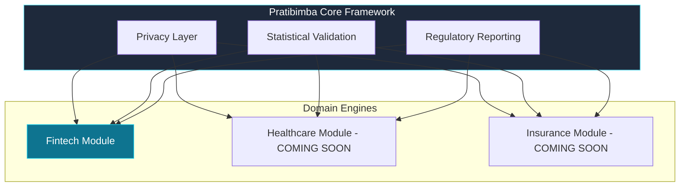

# Pratibimba

## The Enterprise Synthetic Data Standard

> **Mirror your production data, not your privacy risks. Pratibimba provides specialized, high-fidelity synthetic data engines for industry-specific regulated workloads.**

---

## What is Pratibimba?

Pratibimba (Sanskrit for **"Reflection"**) is a modular, enterprise-grade platform designed to solve the data availability crisis in highly regulated industries. 

While generic synthetic data tools struggle with complex statistical dependencies and regulatory scrutiny, Pratibimba uses **domain-specific engines** to create data that is mathematically indistinguishable from the real thing—with **zero risk** of PII leakage.

---

## Why Leading Institutions Choose Pratibimba

### 🎯 Domain Mastery
We don't do "generic." Our engines are built by industry experts to understand **Finance-specific** dynamics like default rates, risk grades, and delinquency cascades.

### 🛡️ Provable Privacy
Don't take our word for it—get the certificate. Every dataset generates a **Privacy Pass** with k-anonymity checks, differential privacy bounds, and membership inference testing.

### ⚖️ Regulatory-First
Built from the ground up for **OCC, FDIC, PRA, and GDPR** compliance. Our reports speak the language your compliance team expects.

### 🚀 Developer Speed
Population of dev/test environments in seconds. Training ML models without the 6-month wait for InfoSec approval.

---

## Available Modules

### 🏦 Fintech Module
Our flagship engine for credit risk, collections, and underwriting. 
*   **Credit Portfolio Generation** with ±1% calibration.
*   **LSTM Delinquency Cascades** for temporal payment dynamics.
*   **Stress Testing** against 2008-style economic scenarios.

**[Explore Fintech Module →](./fintech/)**

---

## Quick Exploration

  

    

      

        <h3>🚀 Test Drive (Sandbox)</h3>
        
Run a local Docker sandbox and generate your first synthetic portfolio in under 5 minutes.

        <a className="button button--primary" href="./fintech/test-drive">Try it now</a>
      

    

    

      

        <h3>🏗️ System Architecture</h3>
        
Deep dive into the Gaussian Copula engines, LSTM networks, and our unique XPrivacy layer.

        <a className="button button--secondary" href="./fintech/architecture">View Architecture</a>
      

    

  

---

## Open Source & Enterprise Ready

Pratibimba is **Open Core**. Our core engines and the primary Fintech module are available under the **MIT License**.

- **No Vendor Lock-in**: Deploy on-prem, in your private cloud, or air-gapped.
- **No Per-Seat Cost**: Scale as much as your hardware allows.
- **Modern Stack**: Python (Scikit-Learn, PyTorch), PostgreSQL, and a robust REST API.

---

**Built for the future of private data. Open for everyone.**

[GitHub Repository](https://github.com/ramprag/DataRobo) · [Fintech Module Overview](./fintech/) · [Report Issues](https://github.com/ramprag/DataRobo/issues)

